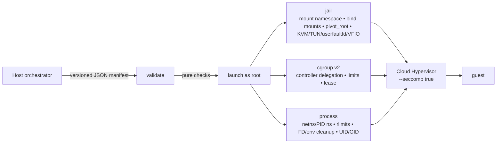
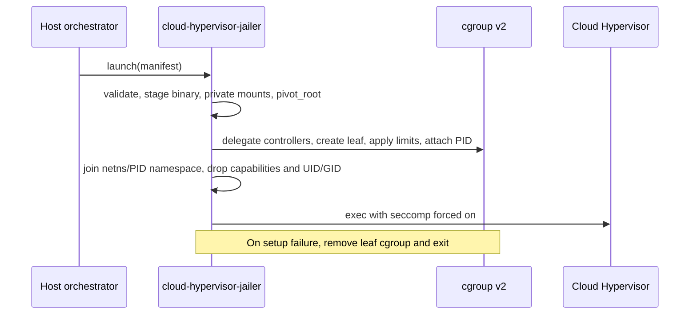

# cloud-hypervisor-jailer

`cloud-hypervisor-jailer` is a Linux-only, manifest-driven privilege boundary
for one [Cloud Hypervisor](https://www.cloudhypervisor.org/) process.

It is designed for host orchestrators that need to launch Cloud Hypervisor
microVMs with a boundary comparable to Firecracker's jailer while keeping the
two launchers independently evolvable. It is currently an early release: the
manifest and operational contract may change before a production-stable major
version.

## Security model

The jailer accepts a strict JSON manifest. Before privileged work begins it
validates the manifest version, bounded machine ID, target identity,
Cloud-Hypervisor executable, sandbox-relative paths, cgroup-v2 property
allow-list, resource limits, and mount destinations.

On Linux, `launch` requires root and then:

- creates a private mount namespace and pivots into the sandbox root;
- mounts only declared non-symlink sources;
- joins a pre-created network namespace when requested;
- configures the declared cgroup-v2 values and resource limits;
- creates jailed KVM, TUN, entropy, and (when the host has it) userfaultfd
  device nodes so Cloud Hypervisor OnDemand restore can create a uffd without
  `vm.unprivileged_userfaultfd=1`;
- recreates only explicitly declared canonical VFIO control/group character
  devices, without bind-mounting host `/dev` or changing host device ownership;
- creates a PID namespace when requested;
- clears inherited environment and non-standard file descriptors;
- drops the complete capability bounding set, sets `no_new_privs`, and changes
  to a non-root UID/GID; and
- execs Cloud Hypervisor with `--seccomp true` forced on.



The launch sequence preserves a single failure boundary: if a later setup step
fails, the private mount namespace disappears with the launcher process and
the cgroup lease moves the launcher back to its parent before removing the
per-machine leaf. A successful `exec` never drops the lease, so the VMM keeps
its configured cgroup.



Cloud Hypervisor creates its API socket in a writable directory created inside
the jail. The API socket is not a host bind mount.

This project does not create TAP devices, eBPF policy, images, disks, or
snapshots. It delegates requested cgroup-v2 controllers and applies the
declared leaf limits; the host remains responsible for the parent hierarchy
and capacity policy.

## Build

```sh
cargo build --release --locked
cargo test --locked
```

Release tags publish Linux amd64 and arm64 musl binaries, each with a SHA-256
checksum, on GitHub Releases.

## Manifest

Use `validate` before handing a manifest to a privileged launcher:

```sh
cloud-hypervisor-jailer validate --manifest /path/to/manifest.json
cloud-hypervisor-jailer launch --manifest /path/to/manifest.json
```

The manifest has a versioned, deny-unknown-fields schema. See the Rust types
in [`src/manifest.rs`](src/manifest.rs) for the current canonical contract. Treat all
paths and arguments as host-orchestrator-controlled inputs; this is not a
safe interface for tenant-provided configuration.

VFIO passthrough is opt-in per manifest. `devices` may contain only the exact
control path `/dev/vfio/vfio` and canonical numeric IOMMU-group paths such as
`/dev/vfio/42`; each destination must be the identical sandbox-relative path.
Group entries require the control device. The jailer verifies every source is
a real character device before pivoting and recreates its major/minor identity
inside the private jail. Arbitrary host devices, symlinks, path aliases,
destination remapping, duplicate nodes, and mounts over `dev/` are rejected.

## Status

The launcher is tested for manifest validation and compiled/tested on native
amd64 and arm64 Linux CI runners. Privileged integration validation is defined
in [docs/testing.md](docs/testing.md) and runs only on an explicitly selected
self-hosted KVM runner.

The detailed module and upstream-comparison rationale is in
[ARCHITECTURE.md](ARCHITECTURE.md).

## License

Apache-2.0. See [LICENSE](LICENSE).
